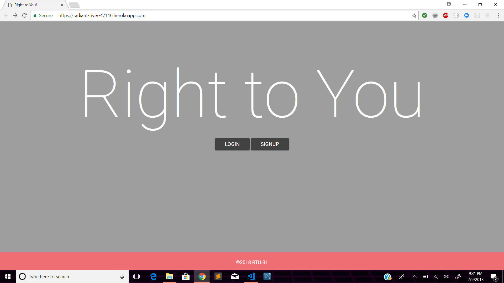

# Right to You 

## GENERAL USEAGE

- Right to You is the flagship application from RTU-31 that puts the customer/client first,
	bringing every day services such as barbers, mechanics, tutors, instructors 
	and more to your doorstep

- Use the account page to post your listing or search for listings at any time using the 
	navigation bar at the top of the site.

- Contact information and availability is located in the resulting profiles for each search
	query.
	
### See it Live!
https://radiant-river-47116.herokuapp.com/

### Technologies Used:

* [Node](https://nodejs.org/en/)
* [MongoDB](https://www.mongodb.com/)
* [Mongoose](http://mongoosejs.com/)
* [EJS](http://ejs.co/)
* [Express](https://expressjs.com)
* [Passport](http://www.passportjs.org/)

### {coming soon in version 1.1.2}

- easy to use quick calendar, see contractor appointment availability, leave 
	contact info and reserve your spot.

- contractor and consumer reviews page
	

### {risk and liability}

- Right to You is a product of the RTU-31 company, as such any claims of damage, uncompleted 
	or not-as-advertised services are not a direct liability of the RTU-31 Corporation
	though should such events occur please direct complaints to our support email.

- please submit and bugs or suggested features to the issues tab of our application's 
    sourcec code at: https://github.com/catdog990/RTU_31/

-------------------------------------------------------------------------------------------
Right to You is an unregistered trademark of the RTU-31 Corporation, but don't use it please.
